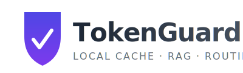

# TokenGuard

<p align="center">
  
</p>

**Local-first conversation cache, RAG retrieval, and intelligent routing to reduce cloud LLM spend.**

TokenGuard is a Python library and CLI that sits between you and expensive cloud LLM calls. It stores every conversation turn in a local SQLite database, indexes it for semantic retrieval, and drafts answers using a cheap local model (Ollama). When the local draft is insufficient, it escalates to your cloud model — saving tokens without sacrificing quality.

---

## Why TokenGuard?

- **💰 Cut cloud spend** — answer common questions locally, cache identical requests, compress outbound messages
- **🧠 Persistent memory** — every interaction is indexed and retrievable across sessions
- **🔌 IDE-native** — MCP tools for Cursor, Claude Code, and Claude Desktop
- **🪶 Minimal infrastructure** — just Python + Ollama + SQLite
- **🔒 Local-first** — embeddings and retrieval happen entirely on your machine

## Quick start

```bash
python3.12 -m pip install tokenguard
tokenguard onboard
tokenguard doctor
```

## Library usage

```python
import sqlite3
from tokenguard.engine import handle_query, ingest_turn
from tokenguard.context import retrieve_context
from tokenguard.ollama_client import OllamaClient
from tokenguard.settings import AppSettings

settings = AppSettings.load()
conn = sqlite3.connect(settings.resolved_db_path())
ollama = OllamaClient(settings.ollama)

# Ingest a user message and retrieve context
result = await handle_query(
    conn, settings, ollama,
    query="What does the config parser do?",
    thread_id=None,
)

# Use the context pack for your own LLM call
citations = result["context_pack"]["citations"]

# Store the assistant reply when done
await ingest_turn(
    conn, settings, ollama,
    thread_id=result["thread_id"],
    role="assistant",
    content="The config parser...",
    title="",
    workspace_fingerprint=result["workspace_fingerprint"],
    provider="my-app",
)
```

## Next steps

- [Getting started](getting-started.md) — install, onboard, first run
- [CLI reference](cli.md) — all available commands
- [Library API](library.md) — use TokenGuard as a Python library
- [MCP tools](mcp-tools.md) — IDE integration via Model Context Protocol
- [Configuration](configuration.md) — YAML, env vars, all options
- [Architecture](architecture.md) — how it works under the hood
